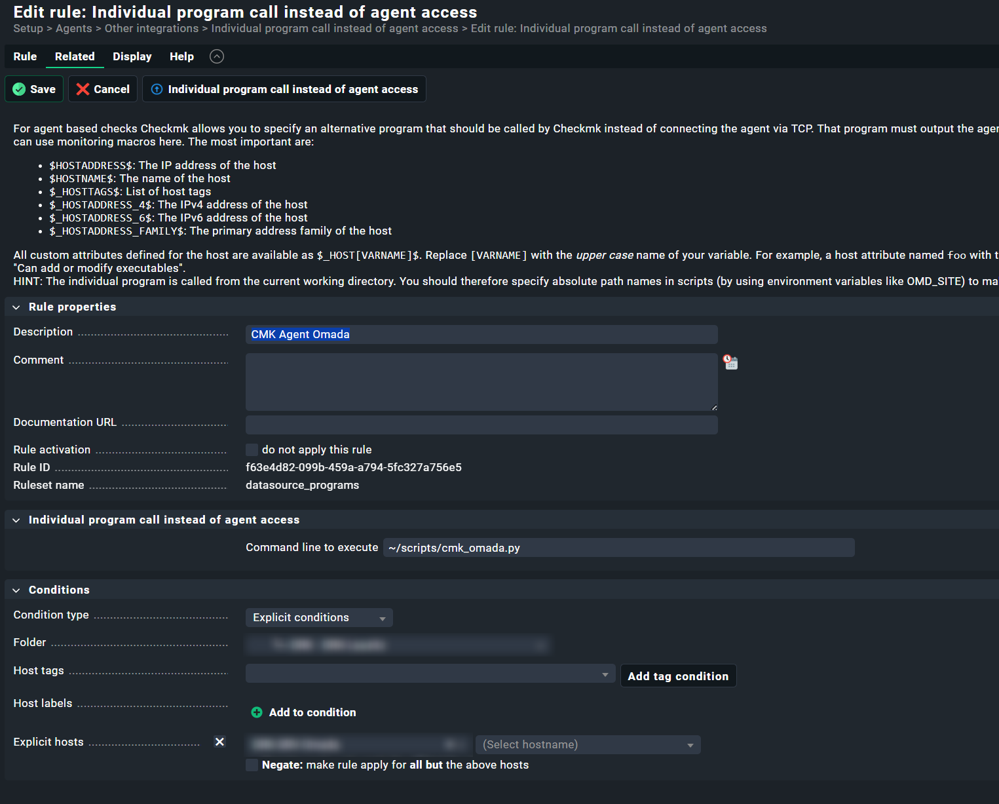

# Instructions for Hardware Controllers

Tested on OC300 and OC200. This is a quick and dirty way to get the local check running with Omada Hardware Controllers.

1. Copy script to local checkmk machine into your site´s user. You can create a subdirectory within the omd users home directory, for example `mkdir ~/scripts/`.

2. Copy these lines into the top part of the script (between shebang and everything else):

```py
import os
os.environ.pop("REQUESTS_CA_BUNDLE", None)
os.environ.pop("CURL_CA_BUNDLE", None)
os.environ.pop("SSL_CERT_FILE", None)

print("<<<check_mk>>>")
print("Version: 2.1.0p30")
print("AgentOS: linux")
print("Hostname: omada")
print("AgentDirectory: /etc/check_mk")
print("DataDirectory: /var/lib/check_mk_agent")
print("SpoolDirectory: /var/lib/check_mk_agent/spool")
print("PluginsDirectory: /usr/lib/check_mk_agent/plugins")
print("LocalDirectory: /usr/lib/check_mk_agent/local")
print("FailedPythonReason:")
print("SSHClient:")
print("<<<checkmk_agent_plugins_lnx:sep(0)>>>")
print("pluginsdir /usr/lib/check_mk_agent/plugins")
print("localdir /usr/lib/check_mk_agent/local")
print("<<<local:sep(0)>>>")
```

3. Make script executable and add controller connection details as described in normal tutorial.

4. Add hosts in cmk for your hardware controller. Enable checkmk-agent in host attributes. Then add a custom integration with wato rule `individual program call instead of agent access` (like the screenshot).

