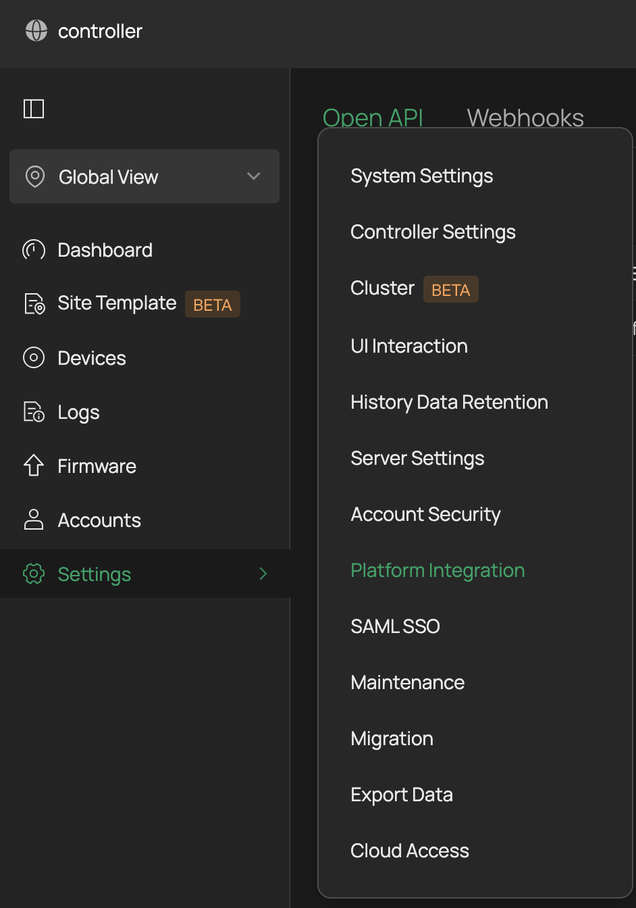
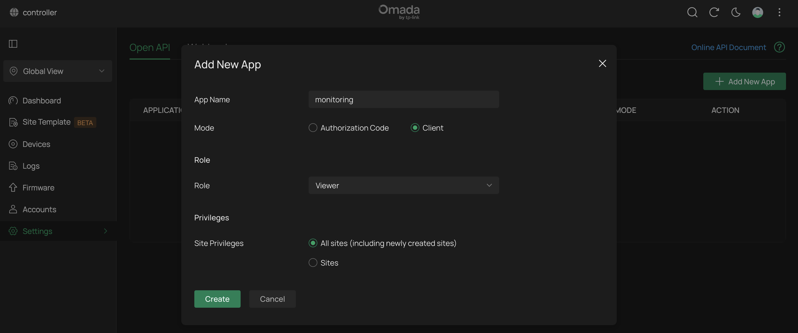
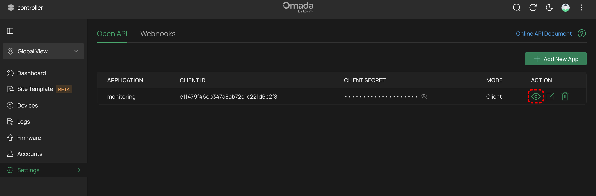
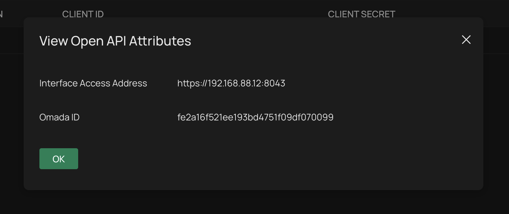

# Setup

Login into your controller and go to `Settings > Platform integration`.

Next add new app, give it a name and view permissions.

Copy details to config part of script:

- CLIENT ID
- CLIENT SECRET
- Interface Access Address
- OMADA ID

