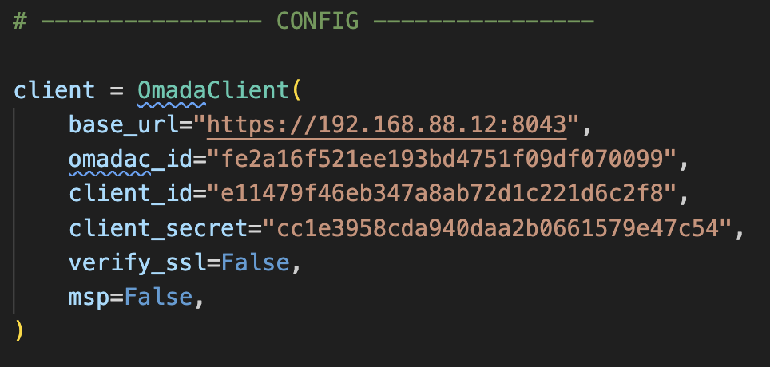

# Check_MK Omada SDN Controller Monitoring

> [!IMPORTANT]
> For now only a local check. I will rework this entirely someday! For now you need to get a little creative when using this. More on that later in text!

Simple local check to monitor devices on Omada SDN Controllers. Works for MSP Mode as well.
This queries the omada open api interface to get all devices and their state. You will be able to get a simple overview on per controller basis over all of your managed devices and will be able to get their system states.

Sample output of the script looks like this:

```sh
# omada % python3 cmk_omada.py
2 'Omada eap772' - Hostname: eap772, Status: Disconnected, Model: EAP772(EU) v2.0, MAC: A82948C12610
```

## API preparation

For the api configuration, you can follow either one of these two instructions (depending on the mode you are running):

- [MSP API setup](.setup/setup-msp.md)
- [Normal controller (single customer) setup](.setup/setup.md)

## Deploying the script

> [!NOTE]
> As is said, I will rework this, to be simpler and integrated into *check_mk wato*

Running this on SDN Software Controller is pretty easy:

- install the agent on your linux box running omada
- copy the script to `/usr/lib/check_mk_agent/local`
- make it executable
- make sure, you have python module `requests` available on your box (for debian: `sudo apt install python3-requests`)
- edit the config part
- add the services in check_mk wato

Hardware Controllers are a bit more tricky for now:

- copy the script to your monitoring box
- make it executable
- make sure, you have python module `requests` present
- edit the config
- work around execution for the agent part via `Setup > Agents > Other integrations > Individual program call instead of agent access`

> [!NOTE]
> I will add more detailed instructions on the hardware controller, when I get to test it a little more!

## Config

For config, change these lines in the monitoring script to match your api credentials and connection details:

